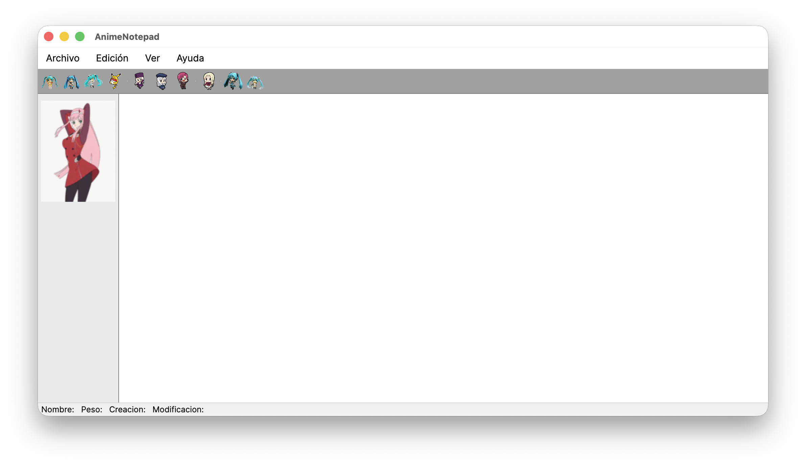
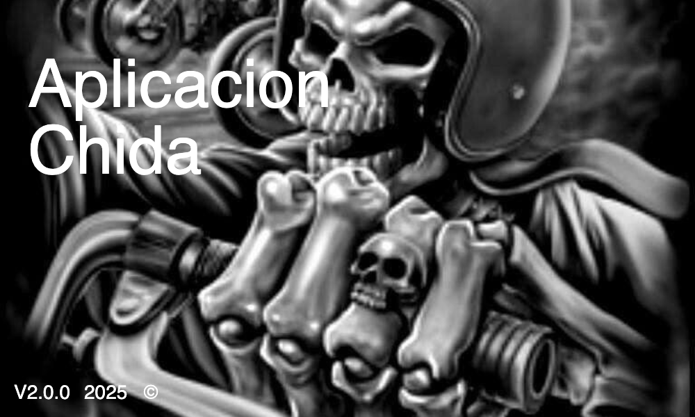
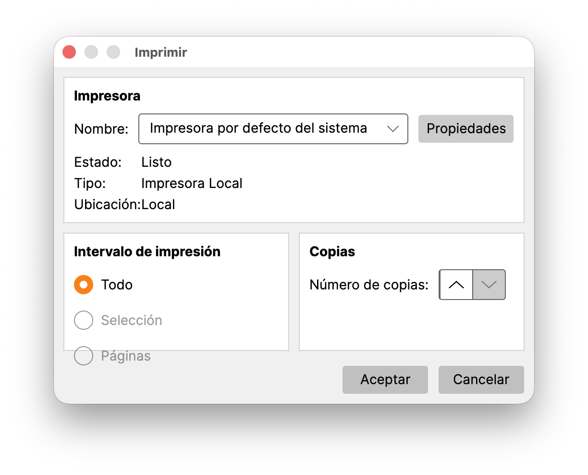
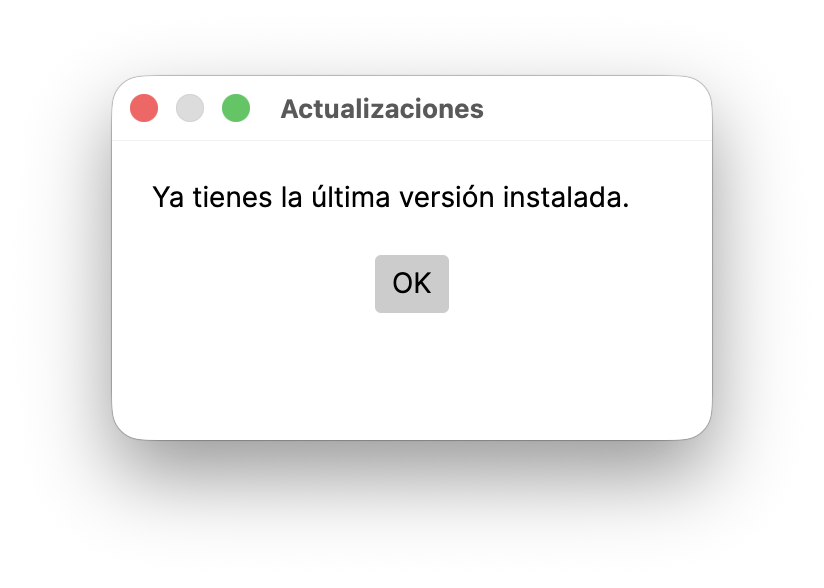

# AnimeNotepad - Notepad con Temática de Anime

[](https://github.com/RichyKunBv/AnimeNotepad/releases)
[](https://github.com/RichyKunBv/AnimeNotepad/releases/latest)
[](https://github.com/RichyKunBv/AnimeNotepad/blob/main/LICENSE)
[](https://dotnet.microsoft.com/es-es/download/dotnet/10.0)
[](https://avaloniaui.net)




Una sencilla pero divertida aplicación de bloc de notas multiplataforma, con una adorable temática de anime para personalizar tu experiencia.

## 🌟 Acerca de este proyecto

**AnimeNotepad** es una aplicación de escritorio multiplataforma creada como una alternativa a los clásicos blocs de notas. La principal diferencia es su interfaz, que está diseñada con personajes e imágenes de anime para darle un toque único y personal. Es ideal para quienes pasan mucho tiempo escribiendo notas y quieren un entorno más alegre y visualmente atractivo en cualquier sistema operativo.

## ✨ Características

* **Edición de texto básica:** Todas las funcionalidades que esperas de un bloc de notas (abrir, guardar, cortar, pegar, etc.).
* **Personalización de apariencia:**
    * Cambia la fuente y el tamaño del texto a tu gusto.
    * Selecciona diferentes colores para la fuente.
* **Impresión:** Envía tus notas directamente a una impresora.
* **Interfaz con temática de anime:** ¡Cada rincón de la aplicación tiene un toque de "monas chinas"!
* **Modo Claro y Modo Oscuro:** Cambio automatico del modo oscuro o claro dependiendo de la configuracion de tu sistema


## 🖼️ Capturas de Pantalla

| Splash Screen | Ventana Principal Modo Oscuro | Ventana Principal Modo Claro | Opciones de Fuente y Color |
| :---: | :---: | :---: | :---: |
|  |  |  | 

| Impresión | Acerca de | Actualizar |
| :---: | :---: | :---: |
|  |  |  |

## 🛠️ Tecnologías y Dependencias

El proyecto está desarrollado en **C# (.NET 10)** y se apoya en las siguientes bibliotecas y tecnologías:

- [Avalonia UI](https://avaloniaui.net/): Framework de interfaz de usuario para aplicaciones de escritorio multiplataforma.
- [Internet](https://github.com/RichyKunBv/AnimeNotepad/releases/latest): Herramienta para actualizar la aplicacion

## ⬇️ Descargas / Instalación

Puedes descargar los binarios precompilados listos para usar desde la sección de **[Releases](https://github.com/RichyKunBv/AnimeNotepad/releases/latest)**.

Están disponibles para todos los sistemas operativos principales (**Windows, macOS y Linux**) en las arquitecturas más utilizadas:
- **x64** (Procesadores Intel y AMD)
- **arm64** (Apple Silicon y procesadores ARM)

```sh
# Para macOS, quitar el atributo de cuarentena si no se puede abrir la app
sudo xattr -cr /Applications/AnimeNotepad.app
```

## 🚀 Cómo compilar y ejecutar

### Requisitos Previos
- [.NET 10 SDK](https://dotnet.microsoft.com/download/dotnet/10.0)

### Compilación y Ejecución
Asegúrate de ejecutar los comandos desde el directorio raíz del proyecto (donde se encuentra `AnimeNotepad.slnx`):

```bash
cd src
dotnet run
```


Para la creación y empaquetado de la aplicación, dispones de scripts automatizados en el directorio `scripts/`:

- **macOS**: `scripts/build_animenotepad_in_macos.sh` (empaqueta como `.app` nativa y también compila para Windows y Linux).
- **Windows**: `scripts/PRE_build_animenotepad_in_windows.ps1` (facilita la creación de paquetes para múltiples sistemas y arquitecturas).
- **Linux**: `scripts/PRE_build_animenotepad_in_linux.sh` (facilita la creación de paquetes para múltiples sistemas y arquitecturas).

> **Nota:** Todos los scripts se encuentran en la carpeta `scripts/`. En los scripts de Linux y Windows no se puede firmar la aplicación para macOS, ya que este paso es exclusivo y debe realizarse desde una Mac.

## 👤 Autor

* **RichyKunBv** - [GitHub](https://github.com/RichyKunBv)

